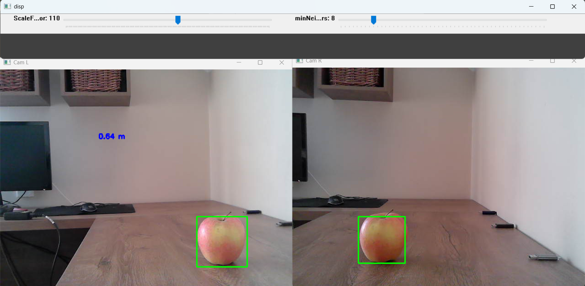
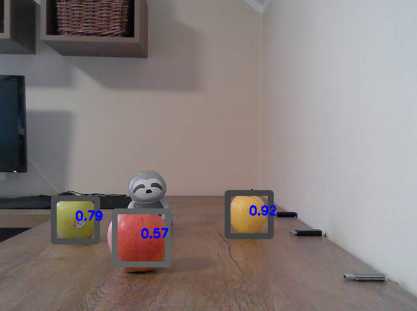

# Stereovision Algorithm Comparison

## Project Description
This project compares different stereovision algorithms for disparity map estimation and real-time distance measurement. The implemented methods include:  
- **StereoBM**  
- **StereoSGBM**  
- **Hybrid based - Cascade classifier mixed with checking average color of selected area**  
- **FastACVNet**  

This project was used in my master's thesis.
    
## Getting Started

1. Clone the repository
```shell
git clone https://github.com/sailor-elite/Stereovision_AlgorithmComparison.git
cd Stereovision_AlgorithmComparison
   ```
2. Install dependencies:
    
```shell
pip install -r requirements.txt
```
    
3. Run the main script:

```shell
python main.py
```
- In main.py, set the variables imgLeft and imgRight to the corresponding stereo image paths.
- Adjust parameters as needed.
- If you would like to take pictures with your cameras adjust ID of your left and right camera and run
```shell
python Taking_Stereovision_Picture.py
```
- In case you want to try realtime distance measurement adjust ID of your left and right camera and run
```shell
python Real_time_distance_measurement.py
```
## Results of the  hybrid based algorithm
<p align="center">

</p>
<p align="center">

</p>

